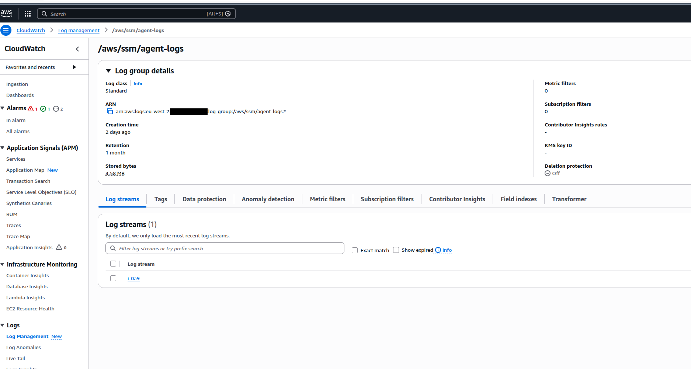

# CloudWatch Agent Configuration for SSM Monitoring

This guide explains how to configure AWS CloudWatch Agent to monitor SSM Session Manager logs on your bastion host. This is useful for troubleshooting connection issues with the forwarder script.

---

## Overview

The CloudWatch Agent collects and sends logs from the SSM Agent to CloudWatch Logs, allowing you to monitor and troubleshoot port forwarding sessions.

---

## Prerequisites

### IAM Permissions

Ensure your bastion host's IAM role includes the following managed policies:

1. **CloudWatchAgentServerPolicy** - Allows the CloudWatch Agent to send metrics and logs
2. **AmazonSSMManagedInstanceCore** - Required for SSM Session Manager functionality

#### Add Policies to IAM Role

```bash
# Get the instance profile name
INSTANCE_ID="i-0a9ce8d5281f39d6b"  # Replace with your bastion instance ID
INSTANCE_PROFILE=$(aws ec2 describe-instances \
  --instance-ids $INSTANCE_ID \
  --query 'Reservations[0].Instances[0].IamInstanceProfile.Arn' \
  --output text | cut -d'/' -f2)

# Get the role name
ROLE_NAME=$(aws iam get-instance-profile \
  --instance-profile-name $INSTANCE_PROFILE \
  --query 'InstanceProfile.Roles[0].RoleName' \
  --output text)

# Attach the required policies
aws iam attach-role-policy \
  --role-name $ROLE_NAME \
  --policy-arn arn:aws:iam::aws:policy/CloudWatchAgentServerPolicy

aws iam attach-role-policy \
  --role-name $ROLE_NAME \
  --policy-arn arn:aws:iam::aws:policy/AmazonSSMManagedInstanceCore
```

---

## Installation

### Step 1: Install CloudWatch Agent

Connect to your bastion host and install the CloudWatch Agent:

```bash
# Download and install CloudWatch Agent
wget https://s3.amazonaws.com/amazoncloudwatch-agent/amazon_linux/amd64/latest/amazon-cloudwatch-agent.rpm
sudo rpm -U ./amazon-cloudwatch-agent.rpm

# Or for Ubuntu/Debian:
wget https://s3.amazonaws.com/amazoncloudwatch-agent/debian/amd64/latest/amazon-cloudwatch-agent.deb
sudo dpkg -i -E ./amazon-cloudwatch-agent.deb
```

### Step 2: Create Configuration File

Create the CloudWatch Agent configuration file:

```bash
sudo vi /opt/aws/amazon-cloudwatch-agent/etc/config.json
```

Paste the following configuration:

```json
{
  "agent": {
    "run_as_user": "root"
  },
  "logs": {
    "logs_collected": {
      "files": {
        "collect_list": [
          {
            "file_path": "/var/log/amazon/ssm/amazon-ssm-agent.log",
            "log_group_name": "/aws/ssm/agent-logs",
            "log_stream_name": "{instance_id}",
            "retention_in_days": 30
          }
        ]
      }
    }
  }
}
```

### Step 3: Apply Configuration

Apply the configuration and start the CloudWatch Agent:

```bash
# Fetch config and start the agent
sudo /opt/aws/amazon-cloudwatch-agent/bin/amazon-cloudwatch-agent-ctl \
  -a fetch-config \
  -m ec2 \
  -s \
  -c file:/opt/aws/amazon-cloudwatch-agent/etc/config.json
```

### Step 4: Verify Agent is Running

```bash
# Check CloudWatch Agent status
sudo /opt/aws/amazon-cloudwatch-agent/bin/amazon-cloudwatch-agent-ctl \
  -a query \
  -m ec2 \
  -c default

# Check system service status
sudo systemctl status amazon-cloudwatch-agent

# Enable auto-start on boot
sudo systemctl enable amazon-cloudwatch-agent
```

---

## Configuration Details

### Log Collection

The configuration collects SSM Agent logs from:
- **File Path**: `/var/log/amazon/ssm/amazon-ssm-agent.log`
- **Log Group**: `/aws/ssm/agent-logs`
- **Log Stream**: `{instance_id}` (automatically replaced with actual instance ID)
- **Retention**: 30 days

### Configuration Options

You can customize the configuration:

```json
{
  "agent": {
    "run_as_user": "root",
    "metrics_collection_interval": 60
  },
  "logs": {
    "logs_collected": {
      "files": {
        "collect_list": [
          {
            "file_path": "/var/log/amazon/ssm/amazon-ssm-agent.log",
            "log_group_name": "/aws/ssm/agent-logs",
            "log_stream_name": "{instance_id}",
            "retention_in_days": 30,
            "timezone": "UTC"
          },
          {
            "file_path": "/var/log/amazon/ssm/errors.log",
            "log_group_name": "/aws/ssm/error-logs",
            "log_stream_name": "{instance_id}",
            "retention_in_days": 30
          }
        ]
      }
    }
  }
}
```

Please note that you need to restart Cloud Watch agent service after applying configuration for taking effect

---

## Management Commands

### Restart CloudWatch Agent

```bash
# Using systemctl
sudo systemctl restart amazon-cloudwatch-agent

# Using agent control script
sudo /opt/aws/amazon-cloudwatch-agent/bin/amazon-cloudwatch-agent-ctl \
  -a stop \
  -m ec2

sudo /opt/aws/amazon-cloudwatch-agent/bin/amazon-cloudwatch-agent-ctl \
  -a fetch-config \
  -m ec2 \
  -s \
  -c file:/opt/aws/amazon-cloudwatch-agent/etc/config.json
```

### Check Agent Status

```bash
# Query current status
sudo /opt/aws/amazon-cloudwatch-agent/bin/amazon-cloudwatch-agent-ctl \
  -a query \
  -m ec2 \
  -c default

# View system service status
sudo systemctl status amazon-cloudwatch-agent

# Check agent logs
sudo tail -f /opt/aws/amazon-cloudwatch-agent/logs/amazon-cloudwatch-agent.log
```

### Stop CloudWatch Agent

```bash
# Stop the agent
sudo systemctl stop amazon-cloudwatch-agent

# Or using control script
sudo /opt/aws/amazon-cloudwatch-agent/bin/amazon-cloudwatch-agent-ctl \
  -a stop \
  -m ec2
```

---

## Viewing Logs in CloudWatch

### Using AWS Console

1. Navigate to **CloudWatch** → **Logs** → **Log groups**
2. Find and select `/aws/ssm/agent-logs`
3. Click on your instance's log stream (instance ID)
4. View and search the SSM Agent logs

  

### Using AWS CLI

```bash
# List log streams
aws logs describe-log-streams \
  --log-group-name /aws/ssm/agent-logs \
  --order-by LastEventTime \
  --descending

# Get recent log events
aws logs tail /aws/ssm/agent-logs \
  --follow \
  --format short

# Filter logs for specific instance
INSTANCE_ID="i-0a9ce8d5281f39d6b"
aws logs tail /aws/ssm/agent-logs \
  --log-stream-names $INSTANCE_ID \
  --follow

# Search for errors
aws logs filter-log-events \
  --log-group-name /aws/ssm/agent-logs \
  --filter-pattern "ERROR" \
  --start-time $(date -d '1 hour ago' +%s)000
```

---

## Troubleshooting

### Agent Not Starting

```bash
# Check for configuration errors
sudo /opt/aws/amazon-cloudwatch-agent/bin/amazon-cloudwatch-agent-ctl \
  -a query \
  -m ec2 \
  -c default

# View agent logs
sudo cat /opt/aws/amazon-cloudwatch-agent/logs/amazon-cloudwatch-agent.log

# Validate JSON configuration
cat /opt/aws/amazon-cloudwatch-agent/etc/config.json | jq .
```

### Logs Not Appearing in CloudWatch

1. **Check IAM permissions**: Verify the IAM role has `CloudWatchAgentServerPolicy`
2. **Verify agent is running**: `sudo systemctl status amazon-cloudwatch-agent`
3. **Check log file exists**: `ls -la /var/log/amazon/ssm/amazon-ssm-agent.log`
4. **Review agent logs**: `/opt/aws/amazon-cloudwatch-agent/logs/amazon-cloudwatch-agent.log`

### Permission Issues

```bash
# Ensure CloudWatch Agent can read SSM logs
sudo chmod 644 /var/log/amazon/ssm/amazon-ssm-agent.log
sudo chown root:root /var/log/amazon/ssm/amazon-ssm-agent.log
```

---

## Integration with Forwarder Script

This monitoring setup helps troubleshoot issues with the forwarder script by:

1. **Session Start Failures**: View SSM Agent logs when port forwarding fails to start
2. **Connection Drops**: Monitor logs when auto-reconnect triggers
3. **Authentication Issues**: Check SSM Agent logs for SSO/credential problems
4. **Bastion State**: Verify bastion host SSM Agent health

### Common Log Patterns to Monitor

```bash
# Port forwarding session started
aws logs filter-log-events \
  --log-group-name /aws/ssm/agent-logs \
  --filter-pattern "StartSession"

# Session termination
aws logs filter-log-events \
  --log-group-name /aws/ssm/agent-logs \
  --filter-pattern "TerminateSession"

# Errors and failures
aws logs filter-log-events \
  --log-group-name /aws/ssm/agent-logs \
  --filter-pattern "ERROR"
```

---

## Cost Considerations

### CloudWatch Logs Pricing

- **Ingestion**: First 5GB/month free, then $0.50 per GB
- **Storage**: First 5GB/month free, then $0.03 per GB
- **Data Transfer**: Standard AWS data transfer rates apply

### Optimization Tips

1. **Set retention period**: Configure log retention (e.g., 30 days) to control storage costs
2. **Filter logs**: Only collect necessary log files
3. **Use metric filters**: Create metrics from logs instead of storing all raw data
4. **Archive old logs**: Export logs to S3 for long-term archival

---

## Alternative: CloudWatch Logs Insights Queries

Query SSM logs directly using CloudWatch Logs Insights:

```sql
# Find all port forwarding sessions
fields @timestamp, @message
| filter @message like /StartSession/
| sort @timestamp desc
| limit 100

# Find errors in the last hour
fields @timestamp, @message
| filter @message like /ERROR/
| sort @timestamp desc
| limit 50

# Track session duration
fields @timestamp, @message
| filter @message like /StartSession/ or @message like /TerminateSession/
| sort @timestamp asc
```

---

## References

- [CloudWatch Agent Documentation](https://docs.aws.amazon.com/AmazonCloudWatch/latest/monitoring/Install-CloudWatch-Agent.html)
- [SSM Agent Logs](https://docs.aws.amazon.com/systems-manager/latest/userguide/monitoring-ssm-agent.html)
- [CloudWatch Logs Insights](https://docs.aws.amazon.com/AmazonCloudWatch/latest/logs/AnalyzingLogData.html)
- [IAM Roles for EC2](https://docs.aws.amazon.com/AWSEC2/latest/UserGuide/iam-roles-for-amazon-ec2.html)

---

## Related Documentation

- [README.md](README.md) - Main forwarder script documentation
- [INSTALLATION.md](INSTALLATION.md) - Installation instructions
- [CHANGELOG.md](CHANGELOG.md) - Version history
